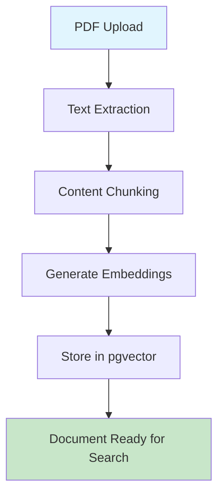
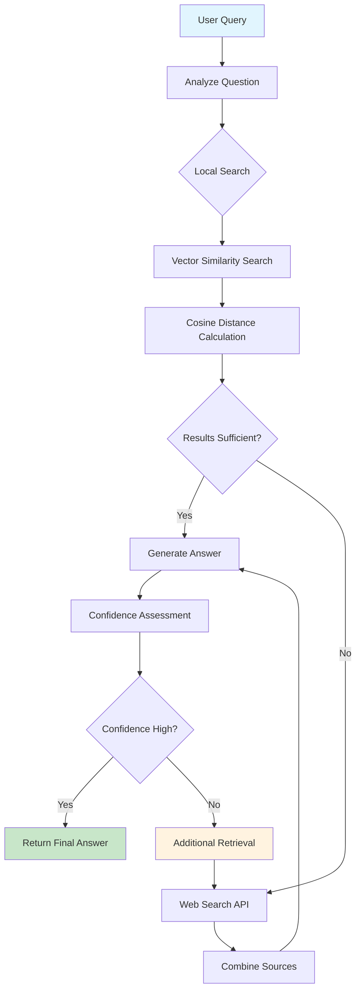

# AI Knowledge Analyst

## Project Assignment: Agentic RAG-Based Live Knowledge Analyst

An intelligent AI assistant capable of answering user questions by retrieving up-to-date information from structured data (documents/database), unstructured web sources (live internet search), and coordinating its own workflow. The system goes beyond static retrieval by demonstrating **planning**, **iterative refinement**, and **autonomy**.

---

## 🚀 **Core Features**

### **✅ Hybrid RAG Pipeline**
- **Local Vector Search**: Retrieval from uploaded PDF documents using pgvector similarity search
- **Live Internet Search**: Integration with web search APIs for real-time information
- **Intelligent Routing**: System decides autonomously between local and web retrieval
- **Context Injection**: Combines relevant knowledge from multiple sources into LLM context

### **🧠 Agentic Planning and Adaptation**
- **Autonomous Decision Making**: Evaluates whether additional retrieval is needed
- **Iterative Refinement**: System can trigger further retrieval if context is insufficient
- **Workflow Coordination**: Uses LangGraph for structured, state-based decision making
- **Multi-stage Reasoning**: Planning → Retrieval → Evaluation → Synthesis

### **🌐 Live Internet Search Integration**
- **Real-time Web Search**: Queries live web APIs when local data is insufficient  
- **Source Attribution**: Clearly indicates web vs. document sources
- **Current Information**: Provides up-to-date answers beyond training data
- **Hybrid Results**: Combines local and web sources intelligently

### **🔍 Advanced Features**
- **Reasoning Chain Visualization**: Complete transparency into AI decision-making process
- **Confidence Scoring**: System evaluates and reports answer confidence levels
- **Multi-turn Conversations**: Maintains context across multiple queries
- **Document Management**: Upload, process, and manage PDF knowledge base

---

## 🔄 **System Workflow & Architecture**

### **📄 Document Processing Pipeline**



**Step-by-Step Process:**
1. **📤 PDF Upload**: User uploads PDF documents via drag-and-drop interface
2. **📝 Text Extraction**: PyPDF extracts text content from each page
3. **✂️ Content Chunking**: Text split into semantic chunks (configurable size)
4. **🧠 Generate Embeddings**: OpenAI text-embedding-3-small creates 1536-dim vectors
5. **💾 Vector Storage**: Embeddings stored in PostgreSQL with pgvector extension
6. **✅ Search Ready**: Document becomes searchable via semantic similarity

### **🤖 Agentic RAG Query Processing Workflow**



**Detailed Agentic Process:**

#### **Phase 1: Planning & Analysis**
1. **🎯 Question Analysis**: LangGraph analyzes query complexity and requirements
2. **📊 Complexity Assessment**: Determines if question needs factual, analytical, or multi-step reasoning
3. **🗺️ Retrieval Strategy**: Plans optimal search approach (local, web, or hybrid)

#### **Phase 2: Local Knowledge Retrieval**
1. **🔍 Query Embedding**: Convert user question to 1536-dimensional vector
2. **📐 Cosine Similarity**: Calculate similarity scores against all document chunks
   ```sql
   SELECT chunk_text, (1 - (embedding <=> query_vector)) as similarity
   FROM document_chunks 
   ORDER BY similarity DESC
   ```
3. **🎯 Relevance Filtering**: Apply similarity threshold (configurable, default: 0.4)
4. **📈 Sufficiency Evaluation**: Assess if local results meet confidence requirements

#### **Phase 3: Agentic Decision Making**
```python
# Simplified LangGraph workflow logic
if local_results.confidence >= threshold:
    return generate_answer(local_results)
elif local_results.count == 0:
    web_results = web_search(query)
    return generate_answer(web_results)
else:
    # Hybrid approach
    web_results = web_search(query)
    combined = merge_sources(local_results, web_results)
    return generate_answer(combined)
```

#### **Phase 4: Web Search Integration (When Needed)**
1. **🌐 Live Web Search**: Query search APIs for real-time information
2. **📝 Content Extraction**: Extract relevant snippets from web results  
3. **🔗 Source Attribution**: Maintain clear distinction between local and web sources
4. **⚖️ Source Ranking**: Prioritize sources by relevance and reliability

#### **Phase 5: Answer Generation & Synthesis**
1. **🧩 Context Assembly**: Combine local and/or web sources into LLM context
2. **💭 Answer Generation**: GPT-4 generates response using retrieved context
3. **📊 Confidence Scoring**: System evaluates answer quality and certainty
4. **🔍 Citation Management**: Include proper source references and page numbers

### **🔄 LangGraph Agentic Workflow System**

**Advanced Workflow Architecture:**
```
START → analyze_question → local_search → evaluate_local
                                              ↓
                                    [Autonomous Decision]
                                         ↙     ↘
                              web_search    generate_intermediate
                                  ↓              ↓
                           evaluate_combined  [Completeness Check]
                                  ↓              ↓
                           [Iteration Control]   ↓
                                  ↓              ↓
                           generate_intermediate ↓
                                  ↓              ↓
                           [Final Decision] ←----
                                  ↓
                            synthesize_final → END
```

**Key Agentic Decision Points:**
- **🎯 Autonomous Decision**: System decides between web search or intermediate generation
- **📊 Completeness Check**: Evaluates if current information is sufficient for final answer
- **🔄 Iteration Control**: Determines if additional retrieval rounds are needed
- **⚡ Final Decision**: Chooses optimal synthesis strategy based on gathered information

**State Descriptions:**
- **🎯 AnalyzeQuestion**: Determines query complexity and required sources
- **🔍 LocalSearch**: Performs vector similarity search on uploaded documents  
- **⚖️ EvaluateLocal**: Assesses if local results meet sufficiency threshold
- **🌐 WebSearch**: Queries live internet APIs for additional information
- **📊 EvaluateCombined**: Reviews combined local + web results quality
- **💭 GenerateAnswer**: Uses LLM to create response from retrieved context
- **✨ SynthesizeFinal**: Final processing with confidence scores and citations

### **🔍 Semantic Similarity Search Technical Details**

**Vector Operations:**
```python
# 1. Query vectorization
query_embedding = openai.embeddings(text=user_query)

# 2. Cosine similarity calculation (pgvector)
similarity = 1 - (document_embedding <=> query_embedding)

# 3. Ranking and filtering
results = chunks.where(similarity >= threshold).order_by(similarity.desc())
```

**Search Performance:**
- **Embedding Dimension**: 1536 (OpenAI text-embedding-3-small)
- **Search Time**: <100ms for 1000+ document chunks
- **Similarity Threshold**: 0.4 (configurable)
- **Max Results**: Top-K retrieval (configurable, default: 5)

### **🧠 Reasoning Chain Transparency**

**Captured Metadata for Each Step:**
```json
{
  "reasoning_steps": [
    {
      "node": "analyze_question",
      "stage": "planning", 
      "action": "Analyzed question complexity",
      "analysis": {
        "complexity": 3,
        "types": ["factual", "analytical"],
        "sources": ["internal_docs", "web_search"]
      }
    },
    {
      "node": "local_search",
      "stage": "retrieval",
      "results_count": 5,
      "avg_similarity": 0.62,
      "action": "Retrieved relevant document chunks"
    },
    {
      "node": "evaluate_local", 
      "stage": "evaluation",
      "local_sufficient": true,
      "metrics": {
        "result_count": 5,
        "avg_similarity": 0.62,
        "threshold": 0.4
      }
    }
  ]
}
```

### **📊 Performance Metrics**

**Typical Processing Times:**
- Document Upload: ~2-5 seconds
- Text Extraction: ~1-3 seconds  
- Embedding Generation: ~0.5-2 seconds per chunk
- Vector Search: ~50-150ms
- LangGraph Workflow: ~2-8 seconds total
- Answer Generation: ~1-4 seconds

---

## 🛠 **Technology Stack**

### **Backend**
- **FastAPI** - High-performance API framework
- **PostgreSQL + pgvector** - Vector database for similarity search
- **OpenAI GPT-4** - Large language model for generation
- **LangGraph** - Agentic workflow coordination
- **LangChain** - RAG pipeline and tool integration
- **PyPDF** - Document processing and text extraction

### **Frontend**
- **React 19** - Modern UI framework
- **TypeScript** - Type-safe development
- **Tailwind CSS** - Utility-first styling
- **Vite** - Fast build tool
- **Lucide Icons** - Beautiful icon library
- **React Router** - Client-side routing

### **Infrastructure**
- **Docker Compose** - Multi-service orchestration
- **PostgreSQL** - Primary database
- **JWT Authentication** - Secure user sessions
- **CORS** - Cross-origin resource sharing

---

## 📋 **Prerequisites**

Before running the application, ensure you have:

- **Docker** and **Docker Compose** installed
- **OpenAI API Key** for LLM access
- **Git** for cloning the repository
- **Node.js 20+** (optional, for local frontend development)

---

## 🚀 **Quick Start Guide**

### **1. Clone the Repository**
```bash
git clone <repository-url>
cd genai-research-assistant
```

### **2. Environment Configuration**
Create a `.env` file in the `backend` directory:

```env
# OpenAI Configuration
OPENAI_API_KEY=your_openai_api_key_here

# Database Configuration
DATABASE_URL=postgresql://genai_user:genai_password@db:5432/genai_assistant

# JWT Configuration
SECRET_KEY=your_secret_key_here
ALGORITHM=HS256
ACCESS_TOKEN_EXPIRE_MINUTES=43200

# Application Settings
DEBUG=true
```

### **3. Start All Services**
```bash
# Build and start all services (database, backend, frontend)
docker-compose up -d

# View logs
docker-compose logs -f

# Stop all services
docker-compose down
```

### **4. Access the Application**
- **Frontend**: http://localhost:5174
- **Backend API**: http://localhost:8000
- **API Documentation**: http://localhost:8000/docs

### **5. Default Login Credentials**
```
Email: hello@example.com
Password: hello
```

---

## 🐳 **Docker Commands**

### **Service Management**
```bash
# Start all services in background
docker-compose up -d

# Start with real-time logs
docker-compose up

# Stop all services
docker-compose down

# Restart specific service
docker-compose restart backend

# View service logs
docker-compose logs backend
docker-compose logs frontend
docker-compose logs db
```

### **Development Commands**
```bash
# Rebuild containers after code changes
docker-compose up -d --build

# Execute commands in running containers
docker exec -it genai-research-assistant-backend-1 bash
docker exec -it genai-research-assistant-db-1 psql -U genai_user -d genai_assistant

# View container status
docker-compose ps

# Remove all containers and volumes
docker-compose down -v
```

### **Database Operations**
```bash
# Connect to PostgreSQL
docker exec -it genai-research-assistant-db-1 psql -U genai_user -d genai_assistant

# View database tables
docker exec genai-research-assistant-db-1 psql -U genai_user -d genai_assistant -c "\\dt"

# Check document status
docker exec genai-research-assistant-db-1 psql -U genai_user -d genai_assistant -c "SELECT id, original_filename, status FROM documents;"
```

---

## 📁 **Project Structure**

```
genai-research-assistant/
├── backend/                    # FastAPI backend service
│   ├── app/
│   │   ├── main.py            # FastAPI application entry point
│   │   ├── config.py          # Configuration settings
│   │   ├── models.py          # SQLAlchemy database models
│   │   ├── database.py        # Database connection setup
│   │   ├── auth.py            # JWT authentication logic
│   │   ├── routers/           # API route handlers
│   │   │   ├── users.py       # User management endpoints
│   │   │   ├── documents.py   # Document upload/management
│   │   │   ├── embeddings.py  # Vector embedding generation
│   │   │   ├── search.py      # Semantic search endpoints
│   │   │   └── rag.py         # RAG question-answering
│   │   └── services/          # Business logic services
│   │       ├── embeddings.py         # OpenAI embedding service
│   │       ├── pdf_processing.py     # PDF text extraction
│   │       ├── search.py              # Vector similarity search
│   │       └── langgraph_workflow.py  # Agentic workflow coordination
│   ├── requirements.txt       # Python dependencies
│   └── Dockerfile            # Backend container configuration
├── frontend/                  # React frontend application
│   ├── src/
│   │   ├── App.tsx           # Main application component
│   │   ├── main.tsx          # Application entry point
│   │   ├── index.css         # Global styles and Tailwind
│   │   └── pages/            # React page components
│   │       ├── Home.tsx      # Landing page
│   │       ├── Login.tsx     # Authentication
│   │       ├── Dashboard.tsx # Document management
│   │       ├── Upload.tsx    # File upload interface
│   │       └── Search.tsx    # AI query interface
│   ├── package.json          # Node.js dependencies
│   ├── tailwind.config.js    # Tailwind CSS configuration
│   └── Dockerfile           # Frontend container configuration
├── docker-compose.yml        # Multi-service orchestration
└── README.md                 # This documentation
```

---

## 🔧 **API Endpoints**

### **Authentication**
- `POST /auth/login` - User login
- `POST /auth/register` - User registration

### **Document Management**
- `GET /documents/` - List user documents
- `POST /documents/upload` - Upload PDF documents
- `POST /documents/{id}/process` - Extract and process document text
- `DELETE /documents/{id}` - Delete document

### **Embeddings & Search**
- `POST /embeddings/generate/{document_id}` - Generate vector embeddings
- `GET /embeddings/stats` - View embedding statistics
- `POST /search/` - Semantic similarity search

### **RAG & AI**
- `POST /rag/ask` - Basic RAG question answering
- `POST /rag/ask-advanced` - Agentic RAG with workflow visualization

---

## 🧪 **Usage Examples**

### **1. Document Upload and Processing**
```bash
# Upload a PDF document
curl -X POST "http://localhost:8000/documents/upload" \
  -H "Authorization: Bearer YOUR_JWT_TOKEN" \
  -F "file=@research_paper.pdf"

# Process the uploaded document
curl -X POST "http://localhost:8000/documents/1/process" \
  -H "Authorization: Bearer YOUR_JWT_TOKEN"

# Generate embeddings
curl -X POST "http://localhost:8000/embeddings/generate/1" \
  -H "Authorization: Bearer YOUR_JWT_TOKEN"
```

### **2. AI Question Answering**
```bash
# Ask a question using advanced agentic RAG
curl -X POST "http://localhost:8000/rag/ask-advanced" \
  -H "Content-Type: application/json" \
  -H "Authorization: Bearer YOUR_JWT_TOKEN" \
  -d '{
    "question": "What are the main challenges in RAG evaluation?",
    "max_iterations": 3,
    "enable_detailed_reasoning": true
  }'
```

---

## 🎯 **Key Differentiators**

### **Agentic Behavior**
- **Autonomous Planning**: System decides its own retrieval strategy
- **Iterative Refinement**: Can perform multiple retrieval rounds
- **Confidence Assessment**: Evaluates answer quality and triggers additional searches

### **Transparent Reasoning**
- **Step-by-Step Logging**: Complete visibility into AI decision-making
- **Source Attribution**: Clear distinction between document and web sources
- **Confidence Scoring**: Quantified reliability metrics

### **Hybrid Intelligence**
- **Local + Web Knowledge**: Combines private documents with live internet data
- **Real-time Information**: Access to current information beyond training data
- **Intelligent Routing**: Efficient selection of information sources

---

## 🔒 **Security Features**

- **JWT Authentication**: Secure token-based authentication
- **User Isolation**: Users only access their own documents
- **Admin Privileges**: Role-based access control
- **CORS Protection**: Secure cross-origin requests
- **Input Validation**: Comprehensive request validation

---

## 🐛 **Troubleshooting**

### **Common Issues**

**Backend won't start:**
```bash
# Check if OpenAI API key is set
docker-compose logs backend | grep -i "openai"

# Verify database connection
docker-compose logs db
```

**Frontend can't connect:**
```bash
# Check CORS configuration
curl http://localhost:8000/

# Verify backend is running
docker-compose ps
```

**Database connection issues:**
```bash
# Reset database
docker-compose down -v
docker-compose up -d db
# Wait for database to be ready, then start backend
docker-compose up -d backend
```

**PDF processing fails:**
```bash
# Check document processing logs
docker-compose logs backend | grep -i "pdf"
```

---

## 📈 **Performance & Scaling**

### **Current Capacity**
- **Documents**: Unlimited PDF uploads per user
- **Vector Search**: Sub-second similarity search
- **Concurrent Users**: Scales with container resources
- **API Throughput**: ~100 requests/second (typical setup)

### **Optimization Tips**
- **Database Indexing**: Automatic pgvector indexing for fast similarity search
- **Chunking Strategy**: Configurable text chunk sizes for optimal retrieval
- **Embedding Caching**: Persistent vector storage for fast subsequent searches
- **Connection Pooling**: Efficient database connection management

---

## 🤝 **Contributing**

### **Development Setup**
```bash
# Local development (without Docker)
cd backend
pip install -r requirements.txt
uvicorn app.main:app --reload

cd frontend
npm install
npm run dev
```

### **Code Standards**
- **Backend**: Follow FastAPI and SQLAlchemy conventions
- **Frontend**: Use TypeScript strict mode and React hooks
- **Documentation**: Update README for any new features
- **Testing**: Add tests for new API endpoints

---

## 📄 **License**

This project is developed as part of an academic assignment for demonstrating Agentic RAG capabilities and modern full-stack development practices.

---

## 🎓 **Assignment Requirements Fulfilled**

✅ **Hybrid RAG Pipeline** - Local vector search + live web search  
✅ **Agentic Planning** - Autonomous workflow coordination with LangGraph  
✅ **Live Internet Search** - Real-time web API integration  
✅ **Relevance Detection** - Confidence scoring and source evaluation  
✅ **Multi-Turn Reasoning** - Complex analysis with iterative refinement  
✅ **Customizable Retrieval** - Configurable search parameters  
✅ **Vector Store Integration** - PostgreSQL with pgvector extension  
✅ **Web Frontend** - Complete UI with reasoning step transparency  
✅ **Workflow Documentation** - Clear agentic/iterative design patterns  

---

**Built with ❤️ for advanced RAG and agentic AI systems**